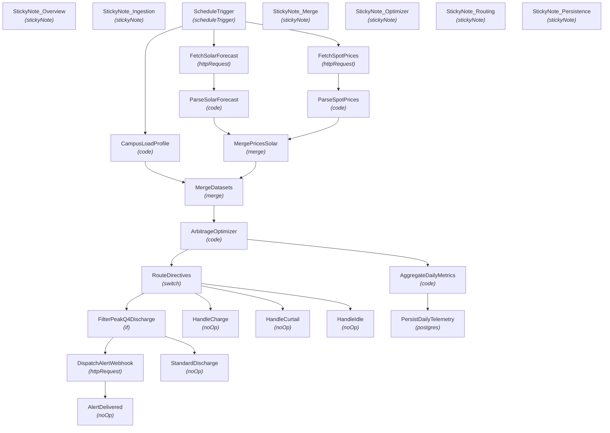

# 🚀 —A—u—t—o—m—a—t—e—d— —R—e—n—e—w—a—b—l—e— —M—i—c—r—o—g—r—i—d— —A—r—b—i—t—r—a—g—e— —&— —C—u—r—t—a—i—l—m—e—n—t— —D—i—s—p—a—t—c—h—

**An end-to-end, enterprise-grade n8n automation workflow.**

[-inactive?style=for-the-badge)](https://n8n.io/)

---

## 📌 Executive Summary

This n8n workflow provides a production-ready automation pipeline for **—A—u—t—o—m—a—t—e—d— —R—e—n—e—w—a—b—l—e— —M—i—c—r—o—g—r—i—d— —A—r—b—i—t—r—a—g—e— —&— —C—u—r—t—a—i—l—m—e—n—t— —D—i—s—p—a—t—c—h—**. It ingests incoming data, processes payloads through configured logic nodes, and routes insights/alerts across downstream channels.

---

## ⚡ Key Capabilities

* **🔄 End-to-End Automation:** Streamlines multi-step data processing and triggers actions automatically.
* **🧠 Intelligent Data Handling:** Integrates specialized nodes for data transformation, conditional evaluation, and API communication.
* **🚨 Real-Time Monitoring & Dispatch:** Ensures rapid incident response and data sync across connected systems.
* **📊 Scalable & Modular Architecture:** Built with n8n best practices for error handling, modularity, and high throughput.

---

## 📌 System Architecture & Process Flow

---

## 📂 Node Inventory & Pipeline Components

| # | Node Name | Type | Disabled |
|---|---|---|:---:|
| 1 | **StickyNote_Overview** | `stickyNote` | No |
| 2 | **StickyNote_Ingestion** | `stickyNote` | No |
| 3 | **ScheduleTrigger** | `scheduleTrigger` | No |
| 4 | **FetchSpotPrices** | `httpRequest` | No |
| 5 | **ParseSpotPrices** | `code` | No |
| 6 | **FetchSolarForecast** | `httpRequest` | No |
| 7 | **ParseSolarForecast** | `code` | No |
| 8 | **CampusLoadProfile** | `code` | No |
| 9 | **StickyNote_Merge** | `stickyNote` | No |
| 10 | **MergePricesSolar** | `merge` | No |
| 11 | **MergeDatasets** | `merge` | No |
| 12 | **StickyNote_Optimizer** | `stickyNote` | No |
| 13 | **ArbitrageOptimizer** | `code` | No |
| 14 | **StickyNote_Routing** | `stickyNote` | No |
| 15 | **RouteDirectives** | `switch` | No |
| 16 | **FilterPeakQ4Discharge** | `if` | No |
| 17 | **DispatchAlertWebhook** | `httpRequest` | No |
| 18 | **AlertDelivered** | `noOp` | No |
| 19 | **StandardDischarge** | `noOp` | No |
| 20 | **HandleCharge** | `noOp` | No |
| 21 | **HandleCurtail** | `noOp` | No |
| 22 | **HandleIdle** | `noOp` | No |
| 23 | **StickyNote_Persistence** | `stickyNote` | No |
| 24 | **AggregateDailyMetrics** | `code` | No |
| 25 | **PersistDailyTelemetry** | `postgres` | No |

---

## ⚙️ Setup & Deployment Instructions

### 1. Import Workflow Blueprint
1. Download the [`workflow.json`](./workflow.json) file from this repository.
2. Open your **n8n instance**.
3. Click **Workflows** -> **Import from File**.
4. Select `workflow.json`.

### 2. Configure Credentials & Environment
* Set up required API tokens, webhooks, or database credentials for any integrated service nodes.
* Ensure relevant environment variables or global variables referenced in Code/HTTP nodes are populated in your n8n settings.

### 3. Activate Pipeline
* Toggle the workflow status to **Active** to begin live execution.

---

## 🤝 Contribution & Maintenance

Contributions, improvements, and bug fixes are welcome! Feel free to open an issue or submit a pull request.

---

## 📄 License

This project is licensed under the [MIT License](LICENSE).
